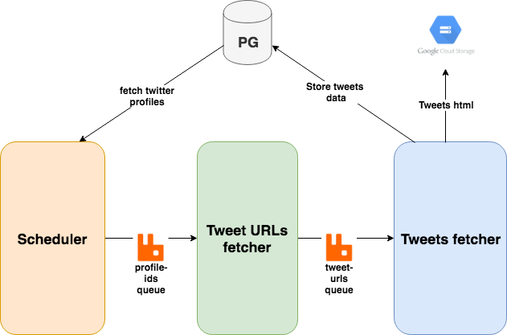

# twitter-crawler

A simple distributed twitter crawler using [Selenium](https://www.seleniumhq.org/) and [Rabbitmq](https://www.rabbitmq.com/) written in Clojure.
A daily scheduled job fetches tweets of all profiles stored in [Postgresql](https://www.postgresql.org/) and optionally puts HTML of tweets in Google Cloud Storage for further processing.

## Prerequisites

* Clojure 1.8
* RabbitMQ
* Postgresql
* [Chrome Driver](http://chromedriver.chromium.org/downloads)

## Usage

**Postgresql Schema**

To create PG database and respected tables:

```
$ psql -a -f resources/twitter-pg-schema.sql
```

**Configurations**

Following configurations are part of **resources/config/default.clj**:

* **twitter-cron**: Cron schedule
* **twitter-postgres**: Postgres connection details for twitter DB
* **chrome-driver**: Path to chromedriver
* **queues**: Name of rabbitMQ queues
* **rabbitmq**: Connection details for Rabbitmq server
* **headless-browser?**: To run selenium chrome browser in headless mode
* **durable-queues?**: To write messages in the queue to the disk


**To run crawler as a single threaded application:**

```
$ config_file=./resources/config/default.clj lein run
```

This process will fetch all latest tweets of all the twitter profiles(stored in PG) only once.


**To run crawler in distributed mode:**

This daily job will keep fetching latest tweets of all the twitter profiles(stored in PG)

* Start scheduler

```
;; Using leiningen
$ config_file=./resources/config/default.clj lein run -m twitter-crawler.twitter-scheduler

;; Using Jar
$ config_file=./resources/env/default.clj java -Dlogfile=/path/to/twitter-profile-producer.log -cp twitter-crawler-0.1.0-SNAPSHOT-standalone.jar twitter-crawler.twitter_scheduler
```

* Start twitter profiles consumer

```
;; Using Leiningen
$ config_file=./resources/config/default.clj lein run -m twitter-crawler.twitter

;; Using Jar
$ config_file=./resources/env/default.clj java -Dlogfile=/path/to/twitter-profile-consumer.log -cp twitter-crawler-0.1.0-SNAPSHOT-standalone.jar twitter-crawler.twitter
```

* Start tweet URLs consumer

```
;; Using Leiningen
$ config_file=./resources/config/default.clj lein run -m twitter-crawler.tweets

;; Using Jar
$ config_file=./resources/env/default.clj java -Dlogfile=/path/to/tweet-urls-consumer.log -cp twitter-crawler-0.1.0-SNAPSHOT-standalone.jar twitter-crawler.tweets
```

**Inserting twitter profiles in PG**

To start fetching tweets of any twitter user, first you will have to insert the profile information into PG.
To insert profile data of any twitter user, run following:

```
$ lein repl
user> (in-ns 'twitter-crawler.twitter-scheduler)
twitter-crawler.twitter-scheduler> (insert-twitter-profile-info "https://twitter.com/mayurJ13")
```


## Architecture


**Scheduler**

A daily job fetches all twitter profiles from Postgresql table **twitter\_profile** and pushes it to the **twitter.ids** queue. Currently, job is scheduled at daily 01:00 AM UTC. You can update the cron schedule in config_file.

**Twitter Profiles consumer**

Consumes twitter profiles from **twitter.ids** queue and open it in the browser using Selenium chrome driver. It fetches all the tweet/retweet URLs of that user and pushes them to another queue **twitter.tweet_urls**. 


**Tweet URLs consumer**

Consumes tweet URLs from **twitter.tweet_urls** queue and launches the chrome browser to get details of the tweet like tweet text, likes, retweets, comments count. It stores these details in PG and optionally stores HTML source of that tweet in Google cloud storage for further processing. You can comment the part where it pushes the HTML content to GCP or you can even write your own consumer which fetches tweet data by just making HTTP request(curl) instead of using Selenium.

## License

Copyright © 2019 DataOrc
